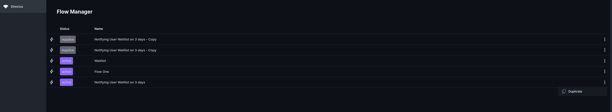

# directus-extension-flow-manager
This directus module extension allows you to manage your flow content from directus.

You can install it via ``npm install directus-extension-flow-manager``

- [x] Duplicate flow
- [x] Export and import flow
- [ ] Add flow validation when Restore

Screenshoots

Changelogs:
- 1.0.0: (13 July 2023)
  * Initial release
- 1.1.0: (21 July 2023)
  * Add Backup and Restore feature
  * Allow user to click the flow row and bring to flow detail page

If you want to contribute kindly to create a PR and if you want to request a feature or report of a bug kindly create the Issue