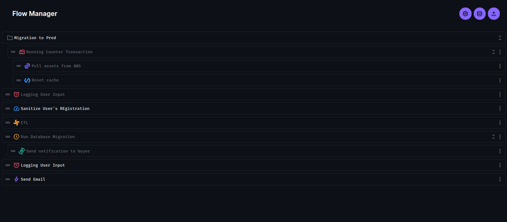

# directus-extension-flow-manager
This directus module extension allows you to manage your flow content from directus.

You can install it via ``npm install directus-extension-flow-manager``

Screenshoots

